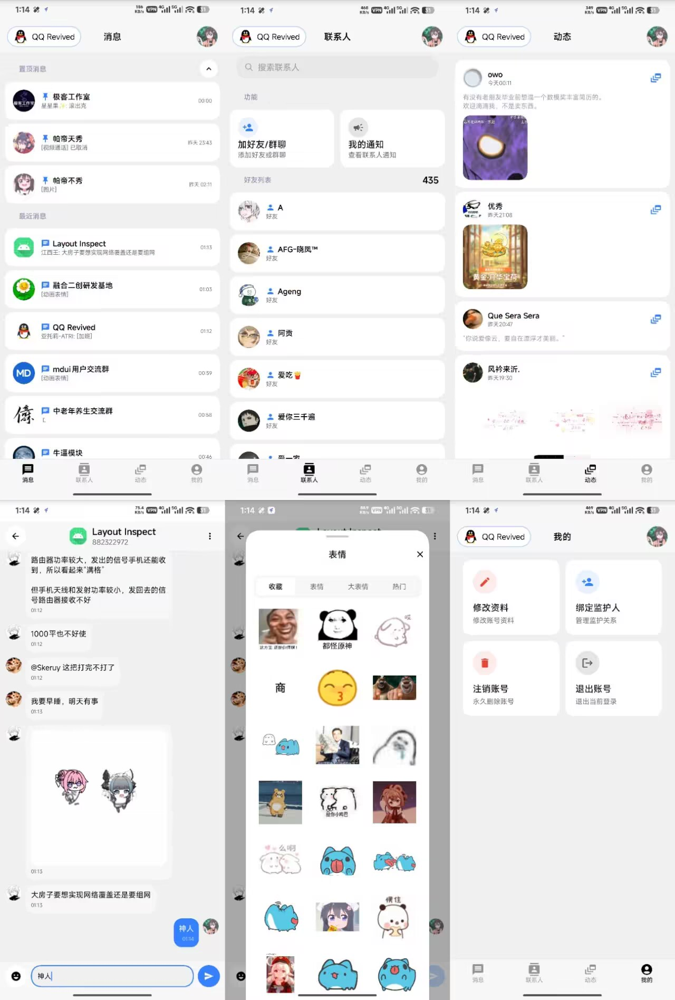

# QQ Revived

QQ Revived 是一个基于 libxposed 的 Android 模块，目标宿主为 `com.tencent.qqlite`。项目主要接管 QQ Lite / Watch 风格宿主界面的首页和聊天页，以 Compose + Miuix 重绘核心交互，同时通过 Hook 层桥接宿主数据、点击事件、头像加载、消息发送和表情能力。

## 界面设计



## 功能概览

- 首页 Compose 重绘：消息、联系人、动态、我的页面。
- 聊天页 Compose 重绘：消息列表、输入栏、表情面板、图片/视频/文件/语音预览。
- 宿主能力复用：复用宿主头像、消息点击、长按、发送文本、发送表情、加载历史消息等能力。
- 全局界面适配：Edge-to-edge、状态栏/导航栏透明、宿主 Watch UI 背景修正。
- 兼容 Xposed 注入场景：自建 `LifecycleOwner`、`SavedStateRegistryOwner`、`ViewModelStoreOwner` 支撑宿主 View 中注入 Compose。


## 宿主
[📱 下载 QQ手表版 9.0.5](/apk/QQ手表版_9.0.5.apk)


## 目标环境

- Android Gradle Plugin 9.2.1
- Kotlin 2.4.0
- compileSdk 37 / targetSdk 37 / minSdk 26
- libxposed API 102，模块 `minApiVersion=101`
- 目标宿主包名：`com.tencent.qqlite`

## 交流群
[💬 加入 Telegram 交流群](https://t.me/niubimokuai)

## 构建

```powershell
.\gradlew.bat :app:assembleDebug
```

常用快速验证：

```powershell
.\gradlew.bat :app:compileDebugKotlin
.\gradlew.bat :app:lintDebug
```

构建产物位于：

```text
app/build/outputs/apk/
```

## 项目结构

```text
app/src/main/java/me/padi/qqlite/revived/
├─ ModuleMainKt.kt              # libxposed 模块入口
├─ App.kt                       # 模块自身 Application
├─ compose/                     # 注入宿主的 Compose 页面
├─ hooks/                       # Xposed Hook 与宿主适配
│  ├─ common/                   # 通用 Hook
│  ├─ home/                     # 首页 Hook 与数据桥接
│  └─ aio/                      # 聊天页 Hook 与数据桥接
├─ legacy/view/                 # 模块管理页 Activity
├─ shared/                      # 跨 UI 体系共享 model / ViewModel
└─ utils/                       # 反射、Context、ComposeView 注入工具
```

更多架构说明见 [PROJECT_ARCHITECTURE.md](PROJECT_ARCHITECTURE.md)。

## Xposed 配置

入口文件：

```text
app/src/main/resources/META-INF/xposed/java_init.list
```

作用域文件：

```text
app/src/main/resources/META-INF/xposed/scope.list
```

当前默认作用域：

```text
com.tencent.qqlite
```

## 开发注意

- Hook 层只处理宿主适配、反射查找和事件桥接。
- UI 状态由 `shared` 层 ViewModel 管理，不在 Hook 层长期维护 UI 状态真相。
- `compose` 和 `shared` 不应反向依赖 `hooks`。
- `utils/HostComposeView.kt` 是宿主 View 中注入 Compose 的关键基础设施，修改后必须实机验证生命周期、返回键和输入法行为。
- 反射字段和方法名与宿主版本强相关，升级宿主后优先检查 `hooks/home` 与 `hooks/aio`。

## 许可证

本项目使用仓库根目录的 [LICENSE](LICENSE)。
